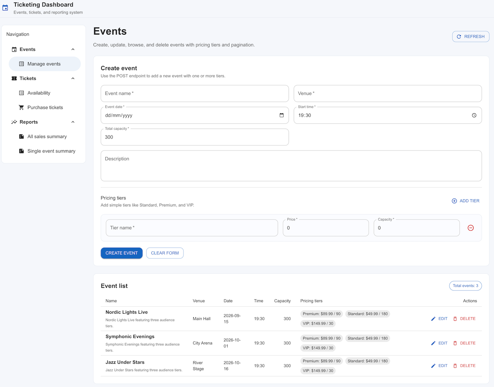
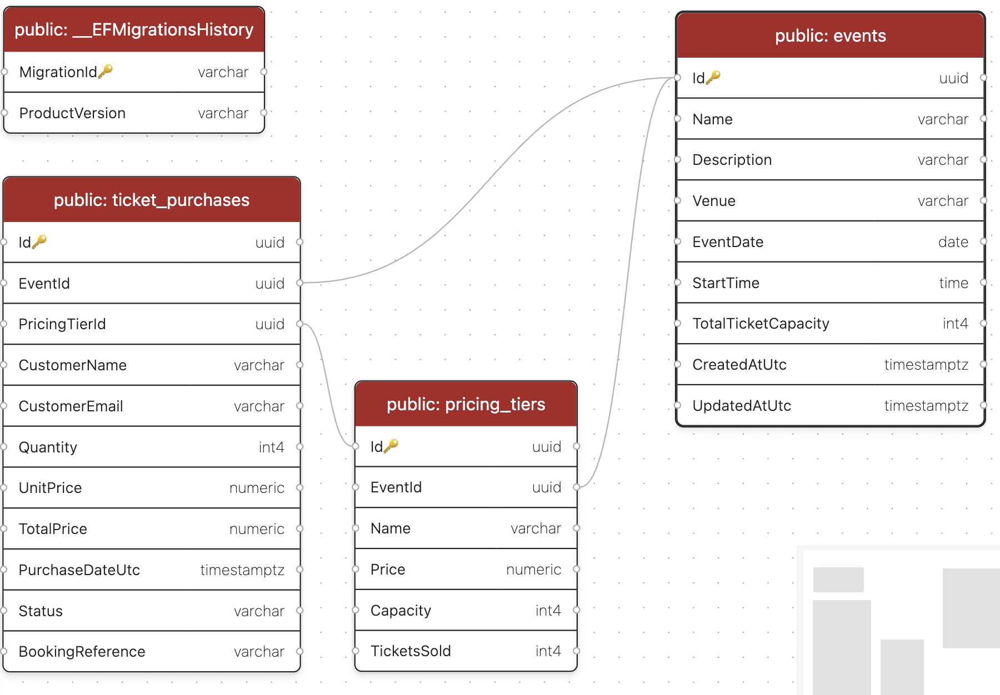

# Ticketing System



## Prerequisites

- .NET SDK 10.0+
- Docker and Docker Compose
- (Optional) `dotnet-ef` local tool already configured in `dotnet-tools.json`

## Solution Architecture

The solution contains the following application projects:

- `Ticketing.Api` - ASP.NET Core Web API with controllers, services, EF Core, validation, exception handling, Swagger
- `Ticketing.Api.Tests` - NUnit test project with integration tests against PostgreSQL Testcontainers and unit tests with Moq
- `Ticketing.Web` - React + Vite frontend with Material UI and a tree-style navigation for events, tickets, and reports

Main API areas:

- `Events` (`/api/v1/events`)
- `Tickets` (`/api/v1/tickets`)
- `Reports` (`/api/v1/reports`)

## Database Configuration


Default local connection string in `Ticketing.Api/appsettings.json`:

`Host=localhost;Port=5433;Database=ticketing;Username=ticketing_user;Password=ticketing_password`

For Docker Compose, the API uses `ConnectionStrings__DefaultConnection` and connects to the `postgres` service with the docker compose network.

The PostgreSQL container is published to your machine on port `5433` by default to avoid conflicts with a local database already using `5432`.

If you want a different host port, set `POSTGRES_HOST_PORT` before starting Compose.

## How to Start the Application

Start the full application stack from the repository root:

```bash
docker compose up --build
```

This starts all services:

- `postgres` - PostgreSQL database
- `ticketing-api` - ASP.NET Core API
- `ticketing-web` - React frontend served by Nginx

API URL:

- `http://localhost:8080`

Frontend URL:

- `http://localhost:3000`

Swagger UI URL:

- `http://localhost:8080/swagger`

If you need to use a custom database host port, start Compose like this:

```bash
POSTGRES_HOST_PORT=5433 docker compose up --build
```

## How to Connect to the Database

From your machine, connect to the PostgreSQL container using the published host port:

```bash
psql "host=localhost port=5433 dbname=ticketing user=ticketing_user password=ticketing_password"
```

## How to run only a Postgres database

```bash
docker run -d \
  --name ticketing-postgres \
  --restart unless-stopped \
  -e POSTGRES_DB=ticketing \
  -e POSTGRES_USER=ticketing_user \
  -e POSTGRES_PASSWORD=ticketing_password \
  -p 5433:5432 \
  -v ticketing-postgres-data:/var/lib/postgresql/data \
  postgres:16-alpine

  docker stop ticketing-postgres
```

If you changed `POSTGRES_HOST_PORT`, use that value instead of `5433`.

You can also connect from inside the container:

```bash
docker compose exec postgres psql -U ticketing_user -d ticketing
```

## How to build only front-end

```bash
docker compose up --build -d ticketing-web
```

### You can develop the front-end locally by running

```bash
npm run build
npm run dev
```

the service will run on http://localhost:30001
you can have two front ends on from docker second from development environment

## How to Stop the Application

Stop the running containers:

```bash
docker compose down
```

To also remove the PostgreSQL data volume:

```bash
docker compose down -v
```

## Running Migrations

Migrations are applied automatically on startup when `Database:MigrateOnStartup=true`.

Manual migration commands:

```bash
dotnet tool restore
dotnet dotnet-ef database update --project Ticketing.Api/Ticketing.Api.csproj --startup-project Ticketing.Api/Ticketing.Api.csproj
```

To create a new migration:

```bash
dotnet tool restore
dotnet dotnet-ef migrations add <MigrationName> --project Ticketing.Api/Ticketing.Api.csproj --startup-project Ticketing.Api/Ticketing.Api.csproj
```

## Running Tests

```bash
dotnet test Ticketing.slnx
```

Frontend production build validation:

```bash
cd Ticketing.Web
npm install
npm run build
```

Optional frontend local development server:

```bash
cd Ticketing.Web
npm install
npm run dev
```

The Vite dev server runs on `http://localhost:3000` and proxies `/api/*` calls to `http://localhost:8080`.

## Example API Requests

Create event:

```bash
curl -X POST http://localhost:8080/api/v1/events \
  -H "Content-Type: application/json" \
  -d '{
    "name": "Summer Concert",
    "description": "Open air music night",
    "venue": "City Arena",
    "eventDate": "2026-12-10",
    "startTime": "19:30:00",
    "totalTicketCapacity": 300,
    "pricingTiers": [
      { "name": "Standard", "price": 49.99, "capacity": 180 },
      { "name": "Premium", "price": 89.99, "capacity": 90 },
      { "name": "VIP", "price": 149.99, "capacity": 30 }
    ]
  }'
```

### utilize http scripting

There is file `EventsTesting.http` at the Tests project with http client call,
Here is an example:

```http request
@baseUrl = http://localhost:8080

### All Events
GET {{baseUrl}}/api/v1/events?pageNumber=1&pageSize=20
Accept: application/json
```

Purchase tickets:

```bash
curl -X POST http://localhost:8080/api/v1/tickets/purchases \
  -H "Content-Type: application/json" \
  -d '{
    "eventId": "<event-id>",
    "pricingTierId": "<tier-id>",
    "customerName": "Jane Doe",
    "customerEmail": "jane@example.com",
    "quantity": 2
  }'
```

Get sales summary:

```bash
curl http://localhost:8080/api/v1/reports/events/<event-id>/sales-summary
```

## How Overselling Is Prevented

The purchase flow uses a transactional strategy with PostgreSQL row locking:

1. Begin a database transaction (`RepeatableRead`).
2. Lock the event row using `SELECT ... FOR UPDATE`.
3. Validate event date, tier membership, tier capacity, and total event capacity.
4. Update `TicketsSold` and insert the purchase record in one transaction.
5. Commit once both inventory and purchase are persisted.

Because purchases for the same event lock the same event row, concurrent requests are serialized and cannot oversell inventory.
